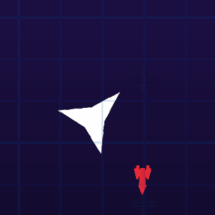

# Minestorm by Fura-i  

Commander **Fura-i** is speaking, the **FlyStar galaxy** is threatened by floating enemy space mines! Take control of the **Furafura** Spacecraft, and help us in this `arcade shoot-them-up` adventure. You can `invite a friend` to play with you in co-op! Beware, the control of the Furafura is not as easy as you think...  

It should be noted that this is not the first time that intergalactic mines appear in the galaxy. The first assault took place on the Vectrex, in 1982. We called this a **`'Minestorm'`**. Now it takes place on Windows, in C++ with `raylib` rendering. The mathematics and physics tools are `made-in home`. 

   

---  
   

You need some explanations to drive the spaceship, right? Well, I understand that `Newton's laws` don't help. I hope you know a little about inertia and acceleration.  
 
## MOVEMENT  

When you press ***'R'***, your ship activates its engine and accelerates. It will accelerate until a maximum speed. If you stop, the inertia will transport the ship further.  

  
   

With practice, you will be able to turn easely with  ***'D'*** and ***'G'***

  

   

In extreme situation, you can press ***'E'*** or ***'T'*** to teleport the ship in a *(almost)* safe place.  

   

## DESTRUCTION  

Your mission is to destroy the mines! Shoot in front of you by pressing ***'F'***. Aim at the mines, and they will explode *(don't worry, the explosion is not deadly)*.  

  

   
You too, you can be destroy! This is the reason why these mines are dangerous. If they touch you... You have 3 lifes though.  

   

---

Now you know everything you have to know. Go! Save the galaxy!