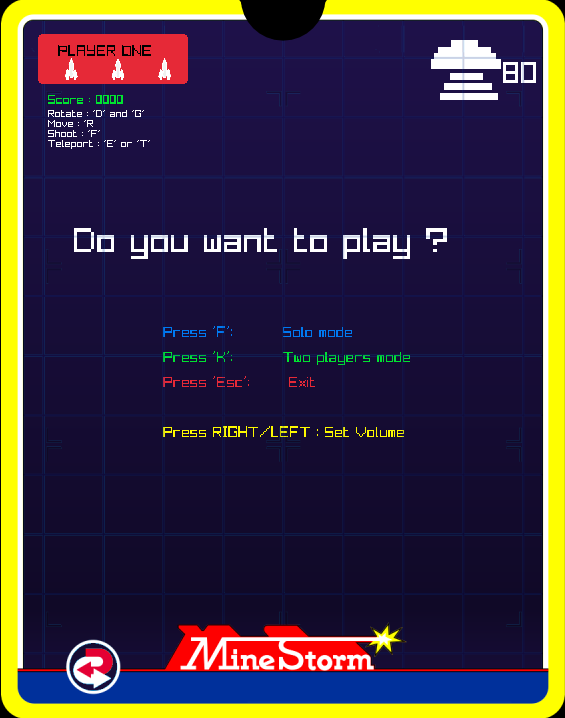

# Projet toolbox mathématiques Isart Digital GP1

Le jeu est complet, toutes les features sont présentes, malgré quelques variantes. Une fois le projet compiler, minestorm.exe apparaît dans le dossier de la solution. Cliquez sur celui-ci pour lancer le jeu sans build.

J'ai ajouté du son, mais l'option "PlayStreamMusic" de Raylib ne fonctionnait pas sur mon PC, contrairement au "PlaySound". Pour profiter des musiques, je me suis permis de mettre les musiques en tant que son, en espérant que cela ne gâche pas votre expérience (ça ne casse rien sur mon PC).

  

## INDEX

1. Mathémathiques
2. Gameplay
3. Contrôle
4. Sitographie   

     

## Les maths
La __toolbox de mathématique__ n'est autre que le dossier "math_toolbox". Il contient toutes les fonctions et les struct qui gèrent les collisions.
Cependant, dans le projet minestorm, certains calculs de maths sont parfois appuyés par des fonctions minimales écritent dans "utils", non inclu dans la toolbox.  
Il y a également un operateur Vector2 (le vector2D de raylib) dans float2.h (mon vector2D), qui doit étre enlevé si la toolbox est utilisé autre-part.
La toolbox hors-projet est disponible en clonant le lien suivant:   ssh://git@git.isartintra.com:2424/2020/GP_2025_MathToolbox/GP1_MARCELLOT_F.git
  
__toolbox de mathématique__: [math_toolbox](math_toolbox)  
__structure et fonctions de bases sur les primitives__: [math_toolbox\src\primitive.cpp](math_toolbox\src\primitive.cpp)  
__class complète float2 (équivalent à vector2D)__: [math_toolbox\src\float2.cpp](math_toolbox\src\float2.cpp)  
__collision binaire entre primitive "simple"__: [math_toolbox\src\2Dcollision.cpp](math_toolbox\src\2Dcollision.cpp)  
__collision binaire SAT__: [math_toolbox\src\SATcollision.cpp](math_toolbox\src\SATcollision.cpp)  
_les .h sont situés dans math_toolbox\include, et porte les mêmes nom._  
__mouvement Newtonnien du joueur__: [src\Component\player_move.cpp](src\Entity\player_move.cpp)  
__collision entre les différentes entités dans le jeu__: [src\collision_engine.cpp](src\collision_engine.cpp)
  
Le mouvement Newtonnien du vaisseau est divisé en plusieurs fonctions :  
* move() : Change le vecteur vitesse en fonction du vecteur accélération. Clamp la vitesse via sa norme.    
__Fonctions utilisées - float2.cpp__ : opérateur '+', opérateur '*',    
length(): retourne la norm du vecteur.  
normalize(): retourne un vecteur de même direction mais de norme 1    

  
  
* slow() : Réduit le vecteur vitesse en fonction d'un coefficient de frottements constant.  
__Fonction utilisée - float2.cpp__: opérateur '*'   
* rotate() : Oriente le vecteur accélération et le référentiel du vaisseau selon la direction, avec une vitesse constante.  
__Fonctions utilisées - float2.cpp__: opérateur '*',  
getRotated(): retourne une copie du vecteur, tourné selon un angle en radian.   

  
    

* update() : Applique un "dérappage" __même quand il n'avance pas__ au vecteur vitesse, puis met à jour la position du vaisseau avec une simple addition de vecteurs.  

__Fonctions utilisées - float2.cpp__: opérateur '+', opérateur '*'  
getRotated(): _voir rotate()_  
dotProduct(): utilisé pour avoir la projection du vecteur vitesse sur l'axe X du vaisseau.
  

Les collisions sont gérer dans la fonction "collisionCheck(Collider* A, Collider* B)" du fichier "collision_engine.cpp" _(accès donné plus haut)_. Avant cette étape, on regarde si les tags de chaque collider réagissent avec les masks des autres. 

Par exemple, le collider du vaisseau à le tag "PLAYER" et le mask "MINE + MINE_FIREBALL". Donc il réagit avec le collider d'une mine qui a le tag "MINE" et le mask "PLAYER + PLAYER_FIREBALL".  

   
Quand on regarde une collision entre 2 polygones, on regarde d'abord la collision entre leur plus grande AABB (on utilise uniquement la AABB "totale" des polygones concaves), puis on regarde la collision entre les 2 formes. Pour les concaves, on parcoure tous leurs polygones convexs un par un.
  

__Fonctions utilisées - 2Dcollision.cpp__: boxsCollide(): collision entre 2 AABB  .
circleBoxCollide(): collision entre une AABB et une Fireball __(pas de AABB pour les fireball)__  .
PolygonsCollide(): collision entre 2 polygons (surcharge de fonction pour pouvoir mettre des convexs ou des concaves). Le vaisseau est un polygon convex, les mines sont concaves.  
boxPolygon(): Retourne un polygon convex à partir d'une AABB.  
circlePolygonCollide(): collision entre une Fireball et un polygon.  

  
    

## Les spécificités gameplay :
 

-SpawnPoint -> Les spawn points ne sont pas conéus comme il était demandé : Chaque spawn point crée une grande mine,
		 et les divisions de cette mine se font é l'endroit oé celle-ci se situe. J'ai décidé de laisser ainsi car le gameplay reste intéressant.

-MineLayer -> Il apparaét 25 secondes aprés que tous les spawn points aient disparus. Une fois arrivé sur l'écran,
		il s'arréte é des positions aléatoire et a une chance sur deux de créer un spawn point.

-MineEmitter (systéme de vague) -> Les mines ont un taux d'apparition différent, et n'apparraissent qu'é partir d'une certaine vague
		Ex : FireMine - vague 2, 5 chances sur 20.

-Mines -> Quand elles sont touchés, elles créent une "explosion" pendant 1 seconde avant de se diviser/tirer.

-Player -> Le joueur est invincible pendant 2 secondes lorsqu'il respawn (visible par le bouclier qui apparraét).

## Les contrôles :
| Key | Command |  
| --- | ------- |  
| C | Affiche les AABB et les repères de chaque entité. Attention, l'axe y est orienté vers le bas, et les AABB ne sont pas toujours parfaitement projetées sur l'image, car c'est difficile d'étre précis.|
|E, T, I ou P |  Téléporte les joueurs à un endroit aléatoire, il se peut que les joueurs apparraissent au bord du cadre de jeu, ce qui le rend difficile à voir, mais il est bien présent (n'hésitez pas à refaire la téléportation dans ce cas)|  
| SPACE | Met le jeu en pause, permet ainsi de voir le score total et de changer le volume du jeu |  
| LEFT ou RIGHT | Respectivement diminué ou augmenté le son du jeu dans le menu ou la pause |
| Les autres touches | Rien à spécifier, les contrôles sont toujours visibles en haut de l'écran |  
|

## Les erreurs/manques non résolues :
* Le son ne peut pas être vu dans le menu pause du mode 2 joueurs, utilisez vos oreilles pour régler ;)

## Lien des ressources :
- Assets inclus dans le Projet
- Musics : https://minimelodies.bandcamp.com/album/minestorm-ost 
- Sounds :	  
(Change Game state / Player shoot / Player Teleportation / Player dead) https://mixkit.co/free-sound-effects/space-shooter/  
(Teleport / player gets hurt / mine explose / mine layer explose...) https://mixkit.co/free-sound-effects/arcade/  
			(New wave) https://mixkit.co/free-sound-effects/ship/  
			(ship fire move) https://mixkit.co/free-sound-effects/fire/  

 

